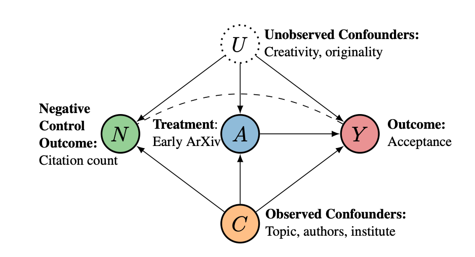

# Estimating the Causal Effect of Early ArXiving on Paper Acceptance



This repository contains code and data for the paper [Estimating the Causal Effect of Early ArXiving on Paper Acceptance](https://arxiv.org/abs/2306.13891) by Yanai Elazar*, Jiayao Zhang*, David Wadden*, Bo Zhang, Noah A. Smith.

## Setup

```bash
# Set up conda env.
conda create --name anon python=3.10
conda activate anon

# Clone this repo and install.
git clone https://github.com/allenai/anonymity-period.git
cd anonymity-period
pip install -r requirements.txt
```


## Data Acquisition and preprocessing

### ICLR Data
ICLR data can be obtained from [ICLR Database](https://cogcomp.github.io/iclr_database/).

### Semantic Scholar Citation Data
We use Semantic Scholar to obtain citation data. These are obtained using the scripts under `./script`.

### (Optional) Processed Data
We provide a few processed dataframes for making analyses easier, these are provided within `./data`. For instructions on generating these
dataframe, see next section.

- [`baby_iclr`](./data/baby_iclr.csv): this contains minimal columns we used from the ICLR database. This is used for the scripts under `./script`
to get the correpsonding S2 data for the ICLR submissions.
- [`c_n`](./data/s2_citation/): these are S2 citation data, where the numeral `n` denotes an `n`-day window for counting citations.
- [`specter_embedding`](./data/submission_cluster_20.csv): this contains 20 topic clusters obtained from running spectral clustering on the embedding from the Specter model.
- [`design_mat`](./data/design_mat.csv): this is the aggregated dataframe with unused columns removed, as the  "design matrix" in regression analysis.
- [`fb_mathced_design_mat_ordered`](./data/fb_matched_design_mat_ordered.csv): this is the matched treated/control group with fine-balance on topic clusters.
- [Bootstrap samples](./data/bootstrap/): These are used for estimating ATET and confidence intervals.

## Notebooks

This study is conducted in the notebook in the order below:


1. Prepare ICLR Data ([`01_iclr_data.ipynb`](./notebooks/01_iclr_data.ipynb)): load data from the ICLR database, generate dataframes `baby_iclr` and `design_mat`
for subsquent analysis. 
2. Statistical Matching ([`02_matching.ipynb`](./notebooks/02_matching.ipynb)): uses `design_mat` and performs statistical matching with fine-balance on topic clusters. Generates `fb_mathced_design_mat_ordered` for subsequent analysis.
3. Obtain S2 citation data ([`03_s2_data_analysis.ipynb`](./notebooks/03_s2_data_analysis.ipynb)): uses `baby_iclr` and scripts under `./script/` to obtain S2 citation data. Generates `c_n` citation data for an `n`-day window.
4. Primary and NOC Analysis ([`04_effect_analysis.ipynb`](./notebooks/04_effect_analysis.ipynb)): uses `design_mat` and `c_n` to perform primary and NOC anlaysis.
5. Ploting results ([`05_plots.ipynb`](./notebooks/05_plots.ipynb)): plots the results in the primary and NOC analysis.


# Reference
```bib
@inproceedings{EZW+23,
	Author = {Elazar*, Yanai and Zhang*, Jiayao and Wadden*, David and Zhang, Bo and Smith, Noah A.~},
	booktitle = {Technical Report},
	Title = {Estimating the Causal Effect of Early ArXiving on Paper Acceptance},
	Year = {2023},
	url = {https://arxiv.org/abs/2306.13891},
}
```
